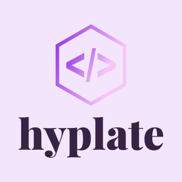

# hyplate

<div style="text-align: center">
  
</div>

[English](./README.md) | 简体中文

---

[](https://github.com/DarrenDanielDay/hyplate/actions/) [](https://github.com/DarrenDanielDay/hyplate/actions/) [](https://badge.fury.io/js/hyplate)

一个非常快的用于构建 Web 界面的 JavaScript 库。

文档正在编写中。

## 许可证

```text
 __________________
< The MIT license! >
 ------------------
        \   ^__^
         \  (oo)\_______
            (__)\       )\/\
                ||----w |
                ||     ||
```
